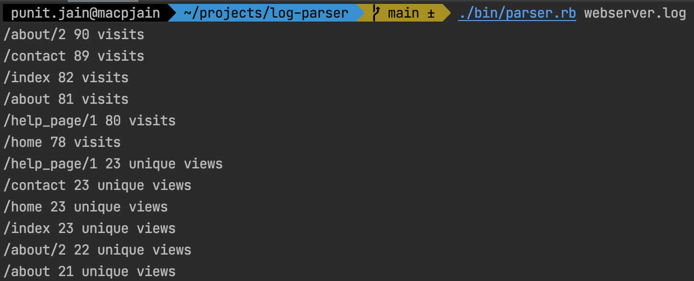

# Log Parser
Parse logs for a given log file and return the number of page views.

## How to use.

Run the ruby script
```ruby
./bin/parser.rb <your log file>
```
**NOTE:** I changed the script file inside `./bin` as I think all executables should be inside `bin` directory.

It returns the list of number of webpage views and unique views. Like



## Design Approach

1. Follow the extreme programming approach. 
   Write test first and then let it fails write minimal code to pass then refactor it and again check if it pass. 
   Then write next test and so on.

1. Divide the problem into separate concerns: 
    - LogFile: Read file from a path and validate.
    - ContentParser: Parse content such as its easy to read and manipulate.
    - PageCounter: Counts the page visits and unique views.
    - View: Present the final output.
    
1. Initial implementation was to store each ip address and page in an OpenStruct. But then there would be repetition of ip address and page both.Which is not ideal for test as well as the memory. So I chose the hash which saves each page name as key and has multiple ip addresses.
Each ip address stores the count while reading the file. It would not be ideal solution if there are more requirements but as a concept of extreme programming [YAGNI](https://martinfowler.com/bliki/Yagni.html) we can discard it.
   
## What can be improved

1. Some of the namings can be improved eg. ContentParser etc.
1. Parse::PageCounter is counting and sorting. Which ideally violates single responsibility. But I am not fully convinced I should create a separate class/module for that.
One idea is it can be solve by a helper module. But IMO it's overkill.
1. End to end tests. I briefly looked into that but could not find a way in limited time to write integration/cucumber test for ruby script. 
   However this [test](https://github.com/punitcse/log-parser/blob/main/spec/lib/parser_spec.rb#L6) covers all the functionality.   
